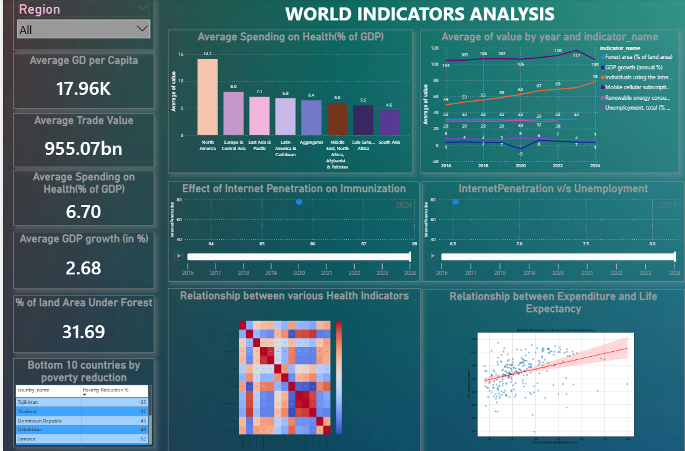

# 🌍 Live API Data Integration: Real-Time Dashboard using Python & Power BI

## 📌 Project Overview

This project focuses on building a **real-time interactive dashboard** to analyze global socio-economic indicators such as **GDP, health, employment, internet usage, and poverty trends**.

The main objective is to automate data collection using a **public API**, process it using **Python**, and visualize insights using **Power BI** with **live data integration**.

---

## 🚀 Key Features

- 🔄 Real-time data fetching using API  
- 🐍 Data processing and cleaning using Python  
- 📊 Interactive Power BI dashboard  
- ⚡ Automatic data refresh (no manual updates)  
- 🌎 Multi-country and regional analysis  
- 📈 Trend and correlation analysis  

---

## 🛠️ Tools & Technologies Used

- **Python** (Pandas, Requests)
- **Power BI**
- **Public API (World Development Indicators or similar source)**
- **Data Cleaning & Transformation**
- **Data Visualization**

---

## 🔄 Data Pipeline Workflow

1. Fetch data from public API using Python  
2. Clean and preprocess data (handle nulls, format columns)  
3. Transform data into structured format  
4. Connect processed data to Power BI  
5. Enable automatic refresh for real-time updates  
6. Build interactive dashboard  

---

## 📊 Dashboard Insights

### 🌐 Overall Economic & Social Analysis
- Average GDP per capita  
- Average trade value  
- Health expenditure (% of GDP)  
- GDP growth rate  
- Forest area percentage  

➡️ Helps understand baseline global development indicators  

---

### 🏥 Regional Health Spending Comparison
- Compared health expenditure across regions  
- Identified regional disparities in health investment  

---

### 📈 Trend Analysis Over Time

Analyzed trends for:
- GDP  
- Internet usage  
- Mobile subscriptions  
- Renewable energy  
- Unemployment  

➡️ Helps track development progress over years  

---

### 🌐 Internet vs Immunization
- Studied relationship between internet access and immunization rates  
- Found positive correlation in many regions  

---

### 💼 Internet vs Unemployment
- Analyzed impact of internet penetration on unemployment  
- Observed that higher internet access may support employment opportunities  

---

### 📉 Poverty Reduction Analysis
- Identified **Bottom 10 countries** with least improvement  
- Identified **Top 10 countries** with highest improvement  

➡️ Helps focus policy and development efforts  

---

### 🔬 Health Indicators Correlation
- Compared relationships between:
  - Life expectancy  
  - Health expenditure  
  - Immunization  
  - Mortality rates  

---

### ❤️ Health Spending vs Life Expectancy
- Used scatter plot and trend line  
- Observed positive relationship between spending and life expectancy  

---

## 📸 Dashboard Preview

---

## ⚡ Key Insights

- Higher internet penetration is linked with better health awareness and employment trends  
- Increased health spending generally improves life expectancy  
- Significant regional gaps exist in healthcare investment  
- Some countries show strong progress in poverty reduction while others lag behind  

---

## ⚠️ Challenges Faced

- Handling missing and inconsistent API data  
- Data transformation for Power BI compatibility  
- Maintaining performance with large datasets  
- Ensuring smooth automatic refresh  

---

## ✅ Solutions Implemented

- Data cleaning using Python (null handling, formatting)  
- Optimized dataset before loading into Power BI  
- Structured data pipeline for automation  
- Used efficient visuals to improve performance  

---

## 🔮 Future Improvements

- Add machine learning models for prediction  
- Deploy dashboard on cloud (Power BI Service)  
- Add alert system for critical changes  
- Improve data granularity  

---

## 🎯 Conclusion

This project demonstrates how to build a **real-time analytics system** by integrating APIs with Python and Power BI.  

It highlights the ability to:
- Automate data pipelines  
- Perform data analysis  
- Generate meaningful insights  
- Build scalable dashboards  

---

## 👨‍💻 Author

**Ankit Raj**  
Aspiring Data Analyst | SQL | Python | Power BI  

---

## ⭐ Support

If you like this project, give it a ⭐ on GitHub and feel free to connect!
